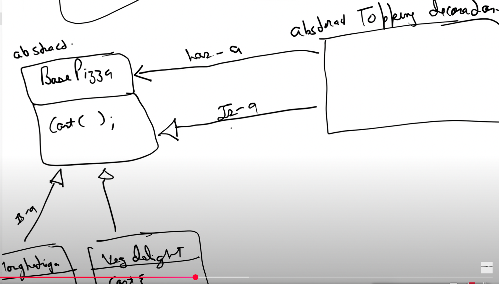

Decorator Design Pattern

In decorator design pattern we just add wrapper of function over function.
(just like nested loop)

Use Case:-
1) Pizza (toppings can be anything)

- Base pizza
- BP + Extra cheeze
- BP + EC + mushroom
- BP + EC + M + EC
2) Coffee
- Base coffee
- BC + extra cream
- BC + EC + Sugar
3) Car

Why u need decorator pattern:-
1) Class Explosion:- Since there are multiple permutations of classes can be made hence this pattern came into existence. We have a base class ready, which will always be there and then we add toppings to it (extra classes).

Decorator Abstract class is both Has-a and Is-a of the abstract class.

(keep this in mind)
can be said we have a base pizza and we add cheeze in it (Has-a), then base pizza + cheeze is also a pizza (Is-a)