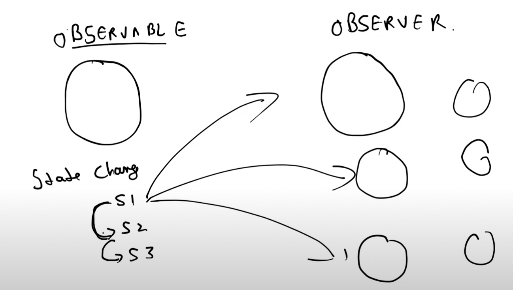
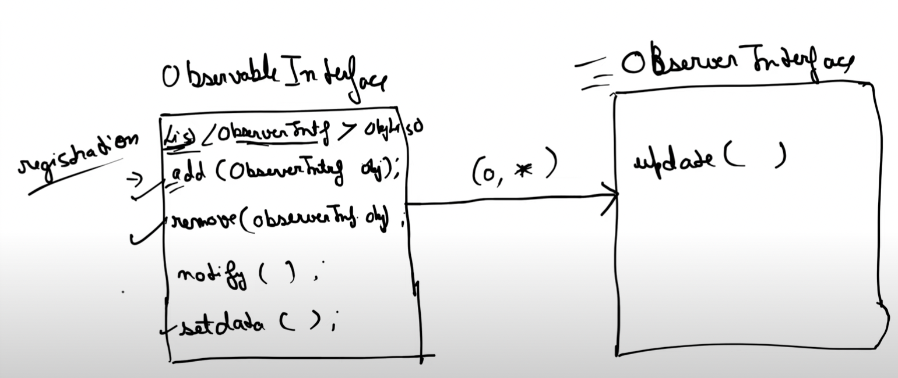
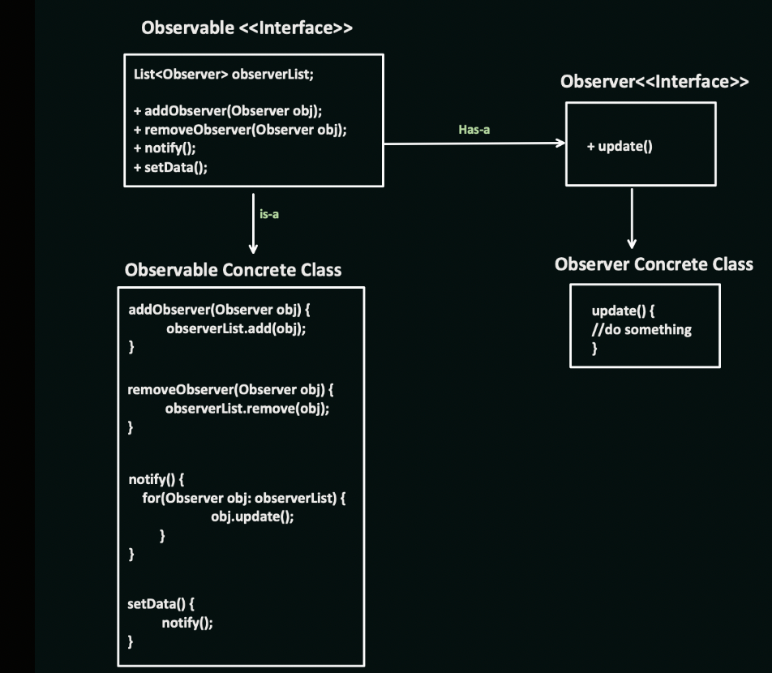
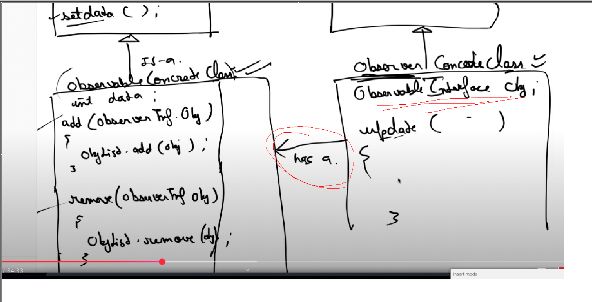

Observable Design Pattern (Behavioural Design pattern)

Whenever the state changes of the Observable, every Observer gets the notification,

Observable and observer

Here we have two interfaces, observable interface and observer interface.
In the observable interface, we have the list of Observer Interface Objects.
(one to many has-a relationship)

ObservableInterface and ObserverInterface

Then we have concrete class for both the interfaces, observable concrete class and observer concrete class.

If we don't want to make multiple observable objects in observer class, we can make a global concrete object in observer class from the observable concrete class. (see the markings in red)
